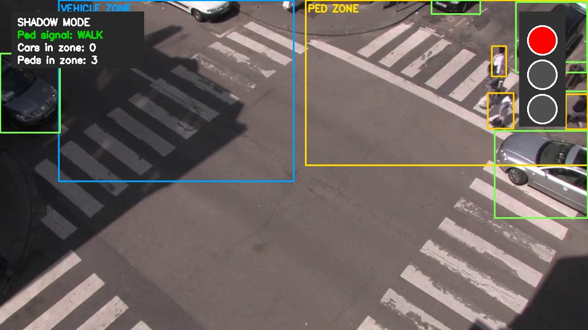
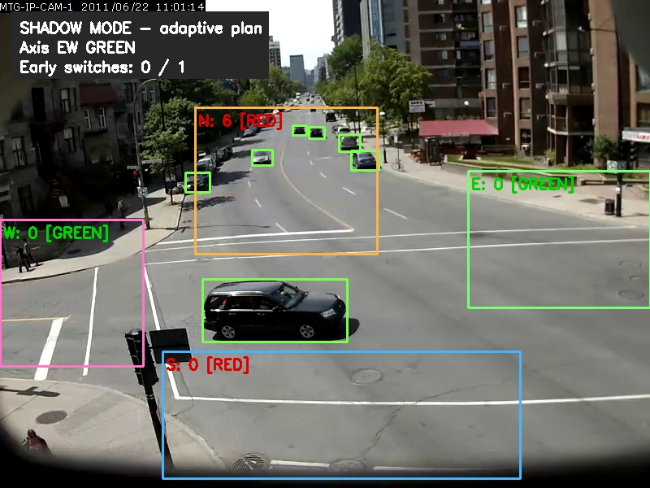
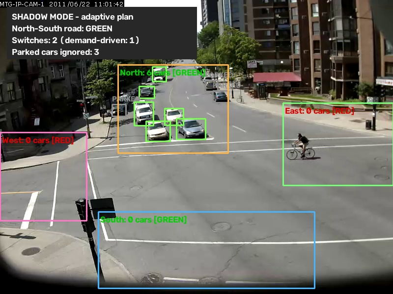

# Smart Traffic Light Automation 🚦 — Pilot Demonstration

A pilot system for **demand-actuated traffic signals**: cameras (or a
simulation) detect vehicles and pedestrians in real time with YOLOv8, and an
adaptive controller only holds a red light when someone actually benefits
from it. No traffic on the cross road? The green stays green — less idling,
less fuel burned, shorter queues.

Every case runs in two modes:

- 🚗 **Simulation** — synthetic traffic, zero setup, reproducible with a seed
- 🎥 **Real** — prerecorded camera footage with live YOLOv8 detection, in
  *shadow mode*: the overlay shows the decisions the adaptive controller
  would issue for the observed traffic. Shadow evaluation is the standard
  first stage of a signal-control pilot, before any signal hardware is touched.

## 🎬 The three demo cases

| Case | Scenario | The point it proves |
|------|----------|---------------------|
| 1 | **Pedestrian crossing** (one road + crosswalk) | Cars keep green until a pedestrian actually needs to cross; the walk phase is granted at the next safe gap |
| 2 | **Two-road intersection** (two one-way feeds) | Green time follows measured demand and queue pressure instead of a fixed plan |
| 3 | **Four-way intersection** (crossroads) | An empty approach never holds up cross traffic; fairness caps guarantee no one waits forever |

```bash
pip install -r requirements.txt

python demo.py --list                                # describe the cases

python demo.py --case 1 --mode simulation            # pedestrian crossing
python demo.py --case 1 --mode real                  # Rouen crosswalk footage

python demo.py --case 2 --mode simulation --seed 42  # two-road intersection
python demo.py --case 2 --mode real                  # two traffic feeds

python demo.py --case 3 --mode simulation            # four-way crossroads
python demo.py --case 3 --mode real                  # Sherbrooke intersection footage
```

`--fullscreen` starts any case fullscreen (press `F` to toggle, `q` to quit).
`--max-frames N` and `--no-display` support scripted/headless runs.

### Case 1 — Pedestrian crossing

No pedestrian → the car light never turns red. When a pedestrian is detected
waiting, the controller serves them after a minimum car-green time — but
**only at a safe gap**: a *dilemma-zone guard* refuses to start the yellow
while a fast vehicle is too close to the stop line to brake comfortably
(the "cars go so fast the system might not catch them" concern is handled by
design, not by hope). A waiting-time cap (45 s) guarantees the pedestrian is
eventually served under constant traffic; the yellow + all-red clearance
protects any vehicle already committed.



### Case 2 — Two-road intersection

The original system: two video feeds (or two synthetic roads), YOLOv8 vehicle
detection, queue-aware ranking by distance to the stop line, and green-time
extension driven by vehicle count and queue pressure, with early switching
when one road empties. Always sequences green → yellow → red.

### Case 3 — Four-way intersection

Two crossing roads, four approaches (N/S/E/W), standard two-phase plan
(NS axis vs. EW axis) made adaptive:

- an axis keeps green while it has demand (up to 30 s),
- an **empty axis is skipped early** as soon as the cross axis has demand,
- detected cross demand is served within ~35 s worst case (max green +
  change interval), and a slow fixed-time recall (every 5 min) guards
  against detector failure so no approach can ever be starved,
- every change runs green → yellow → **all-red clearance** → cross green.



### Parked-car immunity (real modes)

A single frame cannot distinguish a parked car from one queued at a red
light — both are stationary. Real modes therefore run YOLOv8's ByteTrack
tracker (`trackers/bytetrack_traffic.yaml`, tuned for distant traffic
cameras) and a dwell-time filter (`motion_filter.py`): a vehicle that has
never been seen moving, or has been stationary far longer than any signal
cycle, is tagged **PARKED** on screen and excluded from demand counts —
and starts counting again the moment it moves. Queued vehicles are safe:
queue creep resets the dwell clock, and cars that drove into view keep
their full dwell budget. Pedestrians are never filtered — a person
standing at the crossing is exactly the demand Case 1 serves.



## 🎥 Demo videos

Real-mode footage lives in `videos/` (shipped via Git LFS; `demo.py`
re-downloads missing files automatically):

| File | Used by | Source & license |
|------|---------|------------------|
| `rouen_crosswalk.avi` | Case 1 | [Urban Tracker dataset, "Rouen"](https://www.jpjodoin.com/urbantracker/dataset.html) — Jodoin, Bilodeau, Saunier, *Urban Tracker: Multiple Object Tracking in Urban Mixed Traffic*, WACV 2014 (research dataset) |
| `sherbrooke_intersection.avi` | Case 3 | [Urban Tracker dataset, "Sherbrooke"](https://www.jpjodoin.com/urbantracker/dataset.html) (research dataset) |
| `road1.mp4`, `road2.mp4` | Case 2 | Royalty-free traffic clips (e.g. [Pexels 854100](https://www.pexels.com/video/854100/), [Pexels 3044127](https://www.pexels.com/video/3044127/) — download in a browser); synthetic test videos are generated automatically when absent |
| `pedestrian.mp4`, `intersection.mp4` | b-roll | [Mixkit aerial clips](https://mixkit.co) (Mixkit Free License) — presentation visuals; filmed too high for reliable YOLOv8n detection |

**Zone calibration:** real mode counts objects inside configurable detection
zones (fractions of the frame). The defaults in `pedestrian_crossing.py`
(`ZoneConfig`) and `four_way_intersection.py` (`DEFAULT_ZONES`) are calibrated
for the two Urban Tracker sequences; recalibrate them when using other
cameras. This mirrors real deployments, where each camera view is zoned once
at installation time.

## 💡 Why this saves fuel and time

Fixed signal plans burn fuel three ways: vehicles idle at red lights that
protect empty roads, they re-accelerate after unnecessary stops, and
pedestrians get long fixed cycles regardless of demand. Every demo case shows
the same principle from a different angle: **detection replaces the timer**.
The four-way simulation displays live counters (average wait per axis, number
of demand-driven early switches) you can point at during the presentation.

Published evaluations of YOLO-based adaptive signal control report reduced
idle time and fuel consumption at intersections — see
[IIETA 2024](https://iieta.org/journals/ts/paper/10.18280/ts.410407),
[IJERT](https://www.ijert.org/smart-traffic-surveillance-system-with-adaptive-traffic-control-signal-using-yolo),
and [IJRASET 2025](https://www.ijraset.com/best-journal/ai-driven-emergency-vehicle-detection-for-signal-optimization-using-yolov8)
for comparable systems (up to ~95 % detection accuracy in field conditions).

## 🏗️ Architecture

```
demo.py                     ← single entry point: --case {1,2,3} --mode {simulation,real}
├── pedestrian_crossing.py  ← Case 1: PedestrianSignalController + sim + real (shadow)
├── smart_traffic_system.py ← Case 2: detector, queue analyzer, sim + real
│   ├── traffic_core.py     ←   TrafficLightController + statistics
│   ├── counter.py          ←   per-frame / cumulative counting
│   └── sorter.py           ←   queue ordering by stop-line distance
├── four_way_intersection.py← Case 3: FourWayController + sim + real (shadow)
└── video_downloader.py     ← demo-video fetching and synthetic fallbacks
```

Shared design decisions:

- **Every controller takes an injectable clock** (`time_func`) — simulations
  drive it with simulated time (deterministic, seedable), real mode with the
  video frame clock, tests with a fake clock.
- **Safety invariants are structural**: yellow and all-red phases are states
  in the machine, not timers bolted on; no code path can jump green → green.
- **Detection is zone-based and debounced** (rolling presence windows), so a
  single missed frame never flickers the signal plan.
- YOLOv8n runs on GPU when available and **falls back to CPU automatically**.

## 🧪 Testing

```bash
# Core suites (no YOLO weights or videos needed) — controller state machines,
# simulation physics, zone logic, regressions
pytest tests/test_traffic_system.py tests/test_pedestrian_crossing.py tests/test_four_way.py -v

# Integration tests (require ultralytics + video files)
pytest tests/test_animation_run.py -v
```

## 📦 Requirements

```
opencv-python>=4.8.0
numpy>=1.24.0
pytest>=7.4.0
ultralytics>=8.0.0
```

Ultralytics auto-installs PyTorch (CPU build works fine — YOLOv8n runs
~5–15 FPS on CPU, 30–60 FPS with a GPU). YOLOv8n weights (~6 MB) ship in
`weights/` and re-download automatically if missing.

## 🐛 Troubleshooting

- **No display window**: use `--no-display` for headless runs; on remote
  servers ensure X11 forwarding.
- **Slow real mode**: expected on CPU — YOLOv8n at ~5–15 FPS is still fully
  demonstrable; use a GPU for real-time.
- **Missing videos**: `demo.py` re-downloads case videos; `road1/road2` fall
  back to synthesized clips via `python video_downloader.py`.

## 📄 License

See LICENSE file. Demo footage: Urban Tracker sequences are a published
research dataset (cite Jodoin et al., WACV 2014); Mixkit clips are under the
Mixkit Free License.
