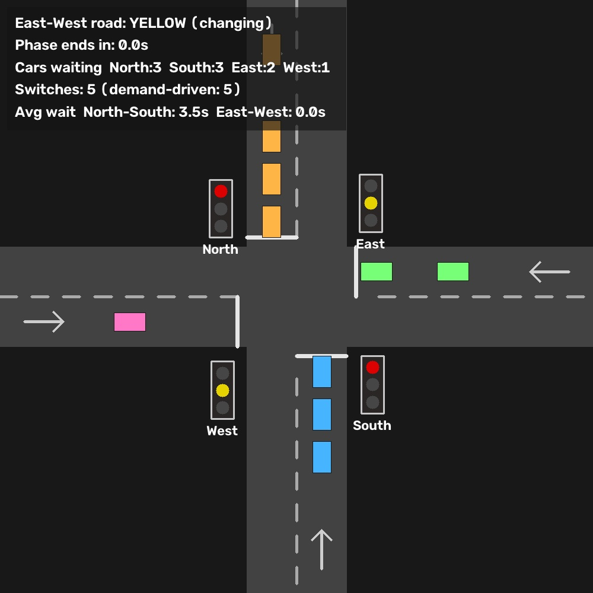
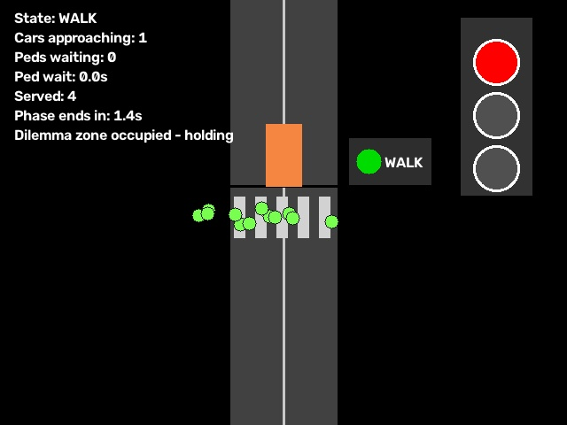
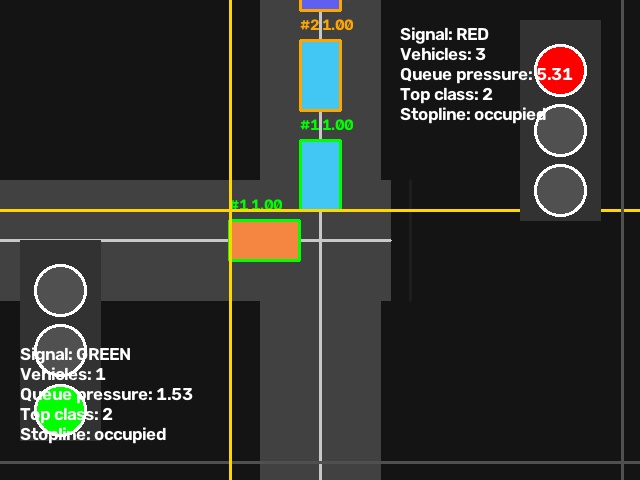
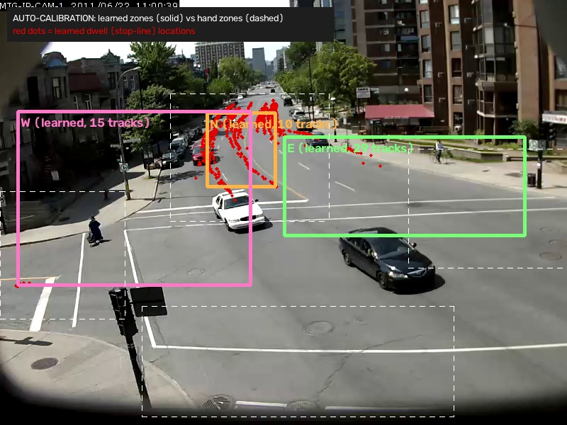
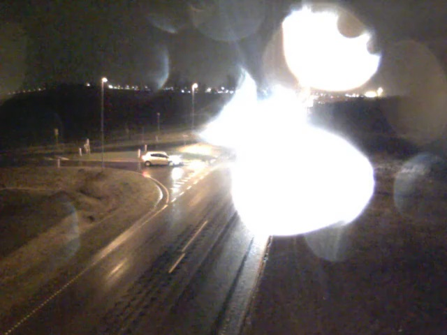

# Smart Traffic Light Automation 🚦

**A pilot demonstration of demand-actuated traffic signals**: cameras (or a
simulation) detect vehicles and pedestrians in real time with YOLOv8, and an
adaptive controller only holds a red light when someone actually benefits
from it. No traffic on the cross road? The green stays green — less idling,
fewer stops, less fuel burned, shorter queues.



---

## What this system is

Fixed signal plans burn fuel three ways: vehicles idle at red lights that
protect empty roads, they re-accelerate after unnecessary stops, and
pedestrians wait out long fixed cycles regardless of demand. This pilot
replaces the timer with **detection**, demonstrated as three escalating
cases, each runnable in two modes from a single entry point:

```bash
pip install -r requirements.txt
python demo.py --list
python demo.py --case <1|2|3> --mode <simulation|real>
```

| Case | Scenario | The point it proves |
|------|----------|---------------------|
| 1 | **Pedestrian crossing** (one road + crosswalk) | Cars keep green until a pedestrian actually needs to cross; the walk phase is granted at the next safe gap |
| 2 | **Two-road intersection** (two one-way feeds) | Green time follows measured demand and queue pressure instead of a fixed plan |
| 3 | **Four-way intersection** (crossroads) | An empty approach never holds up cross traffic; safety sequencing and fairness are guaranteed |

### The two modes

- 🚗 **Simulation** — synthetic traffic with queueing physics, zero setup,
  reproducible with `--seed`, auto-sized to your monitor. Ideal for live
  presentations: the counters on screen (demand-driven switches, average
  wait per axis) tell the fuel-saving story in real time.
- 🎥 **Real (shadow mode)** — prerecorded camera footage with live YOLOv8
  detection and ByteTrack tracking. The detections are real; the overlay
  shows the signal decisions the adaptive controller *would* issue for the
  observed traffic. Shadow evaluation on existing cameras is the standard
  first stage of a real signal-control pilot, before any signal hardware
  is touched — the recorded vehicles obey their original signals, not ours.

---

## Case 1 — Pedestrian crossing

No pedestrian → the car light never turns red. When a pedestrian is
detected waiting, the controller serves them after a minimum car-green
time — but **only at a safe gap**: a *dilemma-zone guard* refuses to start
the yellow while a fast vehicle is too close to the stop line to brake
comfortably. A fairness cap guarantees service within 45 s of accumulated
waiting even under constant traffic (the wait clock survives detection
dropouts and occlusions), and the all-red clearance extends while a
vehicle is still physically on the crosswalk.

| Simulation | Real footage (shadow mode) |
|---|---|
|  |  |

```bash
python demo.py --case 1 --mode simulation --fullscreen
python demo.py --case 1 --mode real     # Urban Tracker "Rouen" crosswalk
```

## Case 2 — Two-road intersection

The original system: two video feeds (or two synthetic roads), YOLOv8
vehicle detection, queue-aware ranking by distance to the stop line, and
green-time extension driven by vehicle count and queue pressure. The light
**rests in green** when the cross road is empty, switches early when the
active road clears, and every changeover runs green → yellow → all-red →
cross green.



```bash
python demo.py --case 2 --mode simulation --seed 42
python demo.py --case 2 --mode real     # bundled road1/road2 traffic clips
```

## Case 3 — Four-way intersection

Two crossing roads, four approaches (North/South/East/West — labelled in
full on screen, with direction arrows on every lane), standard two-phase
plan (North-South axis vs. East-West axis) made adaptive:

- an axis keeps green while it has demand (up to 30 s),
- an **empty axis is skipped early** as soon as the cross axis has demand,
- detected cross demand is served within ~35 s worst case, and a slow
  fixed-time recall (every 5 min) guards against detector failure so no
  approach can ever be starved,
- every change runs green → yellow → **all-red clearance** → cross green.

| Real footage: adaptive plan | Real footage: parked-car immunity |
|---|---|
|  |  |

```bash
python demo.py --case 3 --mode simulation           # auto-fits your monitor
python demo.py --case 3 --mode real     # Urban Tracker "Sherbrooke" intersection
```

### Parked-car immunity (real modes)

A single frame cannot distinguish a parked car from one queued at a red
light — both are stationary. Real modes therefore track every vehicle
across frames (ByteTrack, tuned for distant traffic cameras in
`trackers/bytetrack_traffic.yaml`) and apply a dwell-time filter
(`motion_filter.py`): a vehicle never seen moving, or stationary far
longer than any signal cycle, is tagged **PARKED** on screen and excluded
from demand — and counts again the moment it moves. The filter's history
survives tracker ID churn and looping playback via position-keyed state
adoption. Queued vehicles are safe: queue creep resets the dwell clock,
and cars that drove into view keep their full dwell budget. Pedestrians
are never filtered — a person standing at the crossing is exactly the
demand Case 1 serves.

---

## What it can do

- **Demand-actuated control** with hard safety invariants: conflicting
  greens are structurally impossible, every changeover displays a full
  yellow plus all-red clearance, and fairness caps prevent starvation —
  properties held under adversarial fuzzing (millions of randomized
  controller updates, clock jumps, detection flapping).
- **Real-time detection** of vehicles (car, motorcycle, bus, truck) and
  pedestrians with YOLOv8; GPU when available, automatic CPU fallback.
- **Vehicle tracking** with parked-car exclusion (above).
- **Zone-based, debounced sensing**: per-camera detection zones with
  rolling presence windows, so a single missed frame never flickers the
  signal plan; zones are validated at configuration time.
- **Reproducible experiments**: simulations run on an injected simulated
  clock (identical behavior headless or displayed, at any frame rate, on
  any monitor resolution), seedable for rehearsable demos.
- **Operational robustness**: corrupt/truncated videos fail loudly instead
  of hanging; demo videos re-download with SHA-256 pinning, size caps, and
  atomic writes; looping playback resets tracker state at the seam.
- **74 automated tests** over the controller state machines, simulation
  physics, zone logic, motion filter, downloader, and CLI.

## What it can't do (yet)

Honesty here is the credibility of the pilot:

- **It does not control real signal hardware.** Shadow mode only — there
  is no signal-controller interface (NTCIP/OCIT) and no fail-safe
  hardware interlock. That is deliberately the next phase, not this one.
- **Two-phase plans only.** No protected left-turn phases, no multi-phase
  ring-and-barrier plans, no coordination between neighbouring
  intersections (green waves). One intersection at a time.
- **Detection limits.** YOLOv8-nano at ~5–15 FPS on CPU (30–60 FPS with a
  GPU); small, distant, or heavily occluded objects can be missed; night,
  rain, and snow footage have not been validated; detection zones are
  calibrated per camera view by hand.
- **No speed measurement.** The dilemma-zone guard is presence-based; a
  production system would estimate approach speeds from track history to
  time the yellow onset precisely.
- **Simplified simulation physics.** Straight-through traffic only — no
  turning movements, lane changes, or driver-behaviour modelling. For
  engineering-grade evaluation the controllers should be coupled to a
  microscopic simulator (e.g. SUMO).
- **Evaluation metrics are on-screen counters,** not a calibrated
  fuel/emissions model. Wait-time and stop counts are measured; converting
  them to litres and CO₂ needs an accepted methodology (e.g. drive-cycle
  factors) in the evaluation phase.
- **Privacy posture is minimal.** Nothing is stored — frames are processed
  and discarded — but a deployment would still need a formal privacy
  review (camera placement, retention policy, signage) per local law.

## Next steps (proposed pilot roadmap)

1. **Shadow deployment on existing city cameras** (weeks, software only):
   run exactly this system against live feeds at 2–3 candidate
   intersections; log adaptive-plan decisions vs. the installed fixed
   plans; report measured KPIs — vehicle-hours of avoidable red, stop
   counts, pedestrian wait distributions.
2. **Detection hardening**: fine-tune the detector on local footage
   (night/rain/winter), add track-based speed estimation for the
   dilemma-zone guard, evaluate a larger model on a GPU edge device
   (e.g. Jetson-class) for 30+ FPS.
3. **Controller enrichment**: protected turn phases and ring-and-barrier
   plans; SUMO-in-the-loop evaluation against recorded demand profiles;
   calibrated fuel/CO₂ savings estimates.
4. **Hardware-in-the-loop**: integrate with a signal controller via the
   locally used standard (NTCIP/OCIT), keeping the existing fixed plan as
   the supervised fallback; certified fail-safe review.
5. **Scale-out**: multi-intersection coordination (green waves along a
   corridor), central monitoring dashboard, privacy/compliance sign-off.

---

## Architecture

```
demo.py                     ← single entry point: --case {1,2,3} --mode {simulation,real}
├── pedestrian_crossing.py  ← Case 1: PedestrianSignalController + sim + real (shadow)
├── smart_traffic_system.py ← Case 2: YOLO detector + tracker, queue analyzer, sim + real
│   ├── traffic_core.py     ←   TrafficLightController + statistics
│   ├── counter.py          ←   per-frame / cumulative counting
│   └── sorter.py           ←   queue ordering by stop-line distance
├── four_way_intersection.py← Case 3: FourWayController + sim + real (shadow)
├── motion_filter.py        ← dwell-time parked-car filter (tracking-based)
├── trackers/               ← ByteTrack configuration for traffic cameras
└── video_downloader.py     ← pinned demo-video fetching + synthetic fallbacks
```

Shared design decisions:

- **Every controller takes an injectable clock** (`time_func`) — simulations
  drive it with simulated time, real mode with the video frame clock,
  tests with a fake clock; production would use `time.monotonic` (the
  default).
- **Safety invariants are structural**: yellow and all-red are states in
  the machine, not timers bolted on; no code path can jump green → green.
- **Rendering is resolution-independent**: drawing scales from a logical
  coordinate space, so behavior is identical on a laptop and a 4K wall.

## Command-line options

```
python demo.py --case {1,2,3} --mode {simulation,real} [options]

  --video PATH           real-mode video override (cases 1 and 3)
  --video-road1/2 PATH   case 2 real-mode feeds (both or neither)
  --fps INT              simulation frame rate            (default 30)
  --seed INT             reproducible simulation runs
  --size INT             case 3 render size, 320-2160 px  (default: auto-fit)
  --max-frames INT       stop after N frames (scripted runs)
  --no-display           headless (no GUI window)
  --fullscreen           start fullscreen
  --preset rain          case 3 real: rainy RainSnow intersection with
                         auto-calibrated zones (dataset required locally)
  --kiosk                cycle all cases fullscreen unattended; ESC exits

On-screen controls in every window: SPACE pause, F fullscreen, Q end run
(shows the closing KPI card), ESC exit. docs/DEMO_SCRIPT.md is the
rehearsed presentation run order with fixed seeds and talking points.
```

## Testing

```bash
# Core suites (no YOLO weights or videos needed) — 74 tests
pytest tests/ -v --ignore=tests/test_animation_run.py

# Integration tests (require ultralytics + video files)
pytest tests/test_animation_run.py -v
```

The suites cover controller state machines (including fuzzer-derived
regressions such as flicker-starvation and yellow-skip), simulation
physics, zone logic, the motion filter, downloader hardening, and CLI
validation.

## Demo videos & licensing

Real-mode footage ships in `videos/` via Git LFS; `demo.py` re-downloads
missing files automatically (SHA-256-pinned):

| File | Used by | Source & license |
|------|---------|------------------|
| `rouen_crosswalk.avi` | Case 1 | [Urban Tracker dataset, "Rouen"](https://www.jpjodoin.com/urbantracker/dataset.html) — Jodoin, Bilodeau, Saunier, *Urban Tracker: Multiple Object Tracking in Urban Mixed Traffic*, WACV 2014 (research dataset) |
| `sherbrooke_intersection.avi` | Case 3 | [Urban Tracker dataset, "Sherbrooke"](https://www.jpjodoin.com/urbantracker/dataset.html) (research dataset) |
| `road1.mp4`, `road2.mp4` | Case 2 | Royalty-free traffic clips (e.g. [Pexels 854100](https://www.pexels.com/video/854100/), [Pexels 3044127](https://www.pexels.com/video/3044127/)); synthetic clips are generated when absent |
| `pedestrian.mp4`, `intersection.mp4` | b-roll | [Mixkit aerial clips](https://mixkit.co) (Mixkit Free License) — presentation visuals; filmed too high for reliable YOLOv8n detection |

**Zone calibration:** real mode counts objects inside configurable
fractional detection zones (`ZoneConfig` in `pedestrian_crossing.py`,
`DEFAULT_ZONES` in `four_way_intersection.py`), calibrated here for the
two Urban Tracker sequences. Recalibrate per camera — exactly as
commercial video-detection systems are zoned once at installation.

**Auto-calibration prototype (`auto_calibrate.py`):** instead of drawing
zones by hand, watch the intersection and let the traffic explain the
scene — where vehicles drive is the road, each track's *entry* direction
names its approach (turning vehicles keep their true origin), and where
through-traffic repeatedly dwells is the stop line. Self-supervised from
the existing detector + tracker; no segmentation model required.

```bash
# Learn zones from traffic (tracks are cached: re-analysis is instant)
python auto_calibrate.py videos/sherbrooke_intersection.avi \
    --out docs/auto_calibration.jpg --compare-defaults \
    --tracks-cache tracks.json --json-out learned_zones.json

# Run the shadow demo directly on the learned zones
python demo.py --case 3 --mode real --zones-from learned_zones.json
```

Learned zone sets may be partial: if auto-calibration proves an approach
is not visible from a camera (Sherbrooke has no southern approach in
view), that approach simply never reports demand — and the controller's
detector-failure recall still guarantees it would be served if it
existed.

On the Sherbrooke footage the learned stop line lands exactly on the real
one (red dwell cluster below), and the learned North zone tracks the true
queue lane more tightly than the hand-drawn one:



## Related work

### Deployed systems with published results

Camera/sensor-actuated adaptive signals are proven in production:

- **[Surtrac (Pittsburgh, CMU)](https://aaai.org/papers/00434-13594-smart-urban-signal-networks-initial-application-of-the-surtrac-adaptive-traffic-signal-control-system/)** —
  piloted on 9 intersections from 2012, later ~50: **~26 % travel-time
  reduction, 41 % less idling, 31 % fewer stops, 21 % lower projected
  emissions** ([US DOT ITS
  database](https://www.itskrs.its.dot.gov/2013-b00820)).
- **[Vienna's intelligent pedestrian signals (TU
  Graz)](https://www.tugraz.at/en/tu-graz/services/news-stories/media-service/singleview/article/denkende-fussgaengerampeln-neues-system-der-tu-graz-erkennt-kreuzungswunsch-automatisch0/)** —
  cameras detect waiting pedestrians and crossing intent, replacing push
  buttons; **21 intersections live since 2018**, second generation
  [deployed 2024](https://techxplore.com/news/2024-11-vienna-smart-traffic-smarter.html);
  edge processing, nothing stored — the production counterpart of Case 1.
- **[VivaCity Smart Junctions (Greater Manchester,
  UK)](https://vivacitylabs.com/smart-junctions-traffic-signal-control/)** —
  AI camera sensors controlling live signals since 2020: **~23 %
  journey-time reduction**, up to 30 % improvement over the incumbent.
- **[Fraunhofer KI4LSA (Lemgo,
  Germany)](https://www.fraunhofer.de/en/press/research-news/2022/february-2022/traffic-lights-controlled-using-artificial-intelligence.html)** —
  first real-world deep-RL signal control: **10–15 % flow improvement**.

### Datasets for night / adverse-weather validation (Phase 2)

- **[AAU RainSnow](https://www.kaggle.com/datasets/aalborguniversity/aau-rainsnow)**
  (DOI 10.34740/kaggle/dsv/105294) — 22 five-minute videos from 7 Danish
  intersections, **RGB + thermal pairs**, rain/snow/twilight/night,
  headlight glare, COCO-format ground truth (2,200 annotated frames).
  The primary candidate: its videos feed directly into
  `demo.py --case 3 --mode real --video …` with recalibrated zones, and
  its annotations allow measured (not eyeballed) accuracy scoring.
- **[UA-DETRAC](https://arxiv.org/pdf/1511.04136)** — 10 h of Beijing
  surveillance footage, 1.21 M boxes, **night and rain** subsets
  (frame sequences; convert with ffmpeg).
- **[DAWN](https://data.mendeley.com/datasets/766ygrbt8y/3)** — ~1,000
  annotated vehicle images in **fog/rain/snow/sandstorm**; detector
  benchmarking only.
- A first in-house probe: the unmodified detector on street-level night
  footage found 3–6 vehicles per frame at the default confidence —
  near/mid-range vehicles reliable, distant ones missed, matching the
  Phase 2 hardening plan (GPU + larger model + local fine-tuning).

### Dataset tooling

```bash
python download_datasets.py          # fetch everything obtainable without an account
python download_datasets.py --list   # show the plan + the account-gated remainder
python dataset_builder.py --build    # standardize whatever is present
python dataset_builder.py --index    # list demo-ready sequences
```

`download_datasets.py` fetches the freely downloadable sets into
`datasets/` (gitignored): Ko-PER sequences, the DAWN archive, MIT Traffic
ground truth (its video clips are no longer online), with atomic writes
and resume-by-rerun. Account-gated sets (AAU RainSnow via Kaggle, inD via
academic request, UA-DETRAC mirrors) are listed for manual download.

`dataset_builder.py` converts every dataset's own shape — Ko-PER zips of
per-camera PNG frame folders, RainSnow RGB+thermal video pairs, DAWN
weather-binned stills, Urban Tracker AVIs — into one uniform layout:
`datasets/standardized/<dataset>/<sequence>/video.mp4 + meta.json`
(fps/resolution/frame-count probed automatically; large videos are
hardlinked, not copied; the Kaggle RainSnow package's duplicated folder
tree is deduplicated). Point it at your Kaggle download with
`--rainsnow <path>`, then run any sequence directly:
`python demo.py --case 3 --mode real --video <standardized path>`.

**Audited compatibility** (every standardized sequence opened, probed,
and sample-run through the actual detector):

| Dataset | Sequences | Pipeline verdict |
|---|---|---|
| RainSnow RGB (cam1) | 22 videos, 20 fps, 5 min each | ✅ 3.9 vehicles/frame average; ready for shadow demos + auto-calibration |
| RainSnow thermal (cam2) | 22 videos | ⚠️ 0.3 vehicles/frame — COCO-trained YOLO does not transfer to thermal; needs a thermal-trained model (Phase 2) |
| Ko-PER | 5 assembled videos, 25 fps | ✅ 5–12 vehicles/frame on the main sequences; example clip is near-empty by content |
| Urban Tracker | 2 videos | ✅ bundled demo footage |
| DAWN | 4 image sets (1,027 stills) | ✅ readable, detector finds vehicles; images-only → benchmarking, not signal-loop testing |

**Measured baseline vs. ground truth** (`score_detection.py`): scoring
the exact demo configuration (YOLOv8n, CPU, default confidence) against
all 2,198 annotated RainSnow frames at IoU 0.5 gives **vehicle precision
0.52 / recall 0.36 / F1 0.42** overall — ranging from **F1 0.60** in
moderate conditions (Hasserisvej) down to **recall 0.07** in night +
heavy rain (Egensevej, where precision stays 0.77: what it finds is
real, it simply misses most). Pedestrians at these long vehicle-oriented
camera ranges are effectively undetectable (F1 0.05) — Case 1 pilots
need dedicated crossing-oriented views, as in the Rouen footage where
pedestrian detection works well. These numbers are the honest baseline
of the smallest model with no local training: exactly what the Phase 2
fine-tuning (GPU, larger model, local footage) is budgeted to raise,
with this same script measuring the improvement.

The hardest RainSnow sequences (Egensevej at night in heavy rain —
headlight bloom and raindrops on the lens) yield 0–2 detections per
sampled frame with YOLOv8n. That is a property of the footage, not the
tooling — and precisely the Phase 2 fine-tuning material:



### Further crossing / intersection datasets for system testing

- **[MIT Traffic](https://mmlab.ie.cuhk.edu.hk/datasets/mit_traffic/index.html)** —
  90 minutes of a single stationary camera over a signalized street
  crossing (20 clips, 720×480), with labeled pedestrian ground truth on
  sampled frames; direct download. Good long-duration input for both the
  shadow demos and `auto_calibrate.py` (many full signal cycles).
- **[Ko-PER intersection dataset](https://www.uni-ulm.de/in/mrm/forschung/datensaetze.html)**
  ([IEEE paper](https://ieeexplore.ieee.org/abstract/document/6957976/)) —
  a public German intersection instrumented with 8 cameras and 14
  laserscanners; pedestrians, bicyclists, cars, trucks with reference
  trajectories. Multi-camera views of one crossing — useful for zone
  calibration at different perspectives.
- **[inD](https://levelxdata.com/ind-dataset/)**
  ([paper](https://arxiv.org/abs/1911.07602)) — 11,500+ naturalistic road
  user trajectories (incl. 5,000+ pedestrians/cyclists) at four German
  intersections, 25 Hz, <10 cm accuracy; free for academic use. No video
  needed: the trajectories can drive our controllers **directly** as
  recorded demand profiles — the ideal input for the Phase 3
  engineering-grade KPI evaluation.
- **[MTID — Multi-view Traffic Intersection Dataset](https://ieeexplore.ieee.org/document/9294694/)** —
  drone + infrastructure camera views of the same Aalborg intersection
  (from the AAU group behind RainSnow), for cross-view validation.

### Comparable research systems

Published evaluations of YOLO-based adaptive signal control report reduced
idle time and fuel consumption at intersections — see
[IIETA 2024](https://iieta.org/journals/ts/paper/10.18280/ts.410407),
[IJERT](https://www.ijert.org/smart-traffic-surveillance-system-with-adaptive-traffic-control-signal-using-yolo),
and [IJRASET 2025](https://www.ijraset.com/best-journal/ai-driven-emergency-vehicle-detection-for-signal-optimization-using-yolov8)
for comparable systems (up to ~95 % detection accuracy in field
conditions). The demo footage is from the peer-reviewed Urban Tracker
dataset (WACV 2014), so detection results are reproducible against
published ground truth.

## Requirements & troubleshooting

```
opencv-python>=4.8.0   numpy>=1.24.0   pytest>=7.4.0   ultralytics>=8.0.0
```

- Ultralytics auto-installs PyTorch (CPU build works; a GPU makes real
  mode real-time) and the `lap` tracker dependency on first use. YOLOv8n
  weights (~6 MB) ship in `weights/` and re-download automatically.
- **No display window?** Use `--no-display`, or ensure X11 forwarding on
  remote machines. If OpenCV windows fail after installing other packages,
  check that `opencv-python-headless` has not shadowed `opencv-python`.
- **Slow real mode?** Expected on CPU (~5–15 FPS) — still fully
  demonstrable; use a GPU for real-time.

## License

See LICENSE. Demo footage: Urban Tracker sequences are a published
research dataset (cite Jodoin et al., WACV 2014); Mixkit clips are under
the Mixkit Free License.
